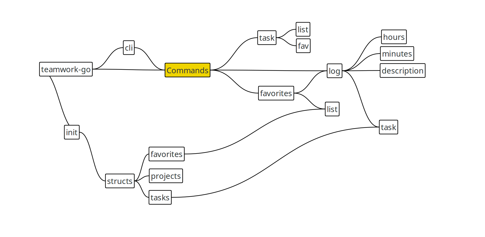

# Teamwork-Go

teamwork-go is a cli to interact with [Teamwork](https://www.teamwork.com/) time entries.

## Install

* Download the latest release from the [releases page](https://github.com/gabeduke/teamwork-go/releases) and unzip.
* Copy the `teamwork-go` binary to a location in your path `sudo cp teamwork-go /usr/local/bin/`
* Create a config file (this can be skipped if you prefer to use command line flags):

    ```bash
    cat <<EOF > ~/.teamworkgo.yaml
    global:
    companyName: [company_xxx]
    apiKey: [apikey_xxx]
    userId: [userId_xxx]
    EOF
    ```

## Run

If the binary is on your path simply run `teamwork-go` from a terminal

## Contribute

* Install Golang and set up GOROOT & GOPATH: https://golang.org/doc/install
* Clone repository and get project dependencies. `go get` will clone the repository to `$GOPATH/src/github.com/[username]`. This is important for linking local dependencies.

    ```bash
    go get -v github.com/gabeduke/teamwork-go/...
    ```

* Commands for local development (from project root):
    * Run: `go run main.go [command]`
    * To build a standalone binary: `go build`
    * To install dev version: `go install`

* Architecture

    To edit architecture diagrame open the [architecture](architecture.mapz) file in [Labyrinth](https://people.gnome.org/~dscorgie/labyrinth.html)
    