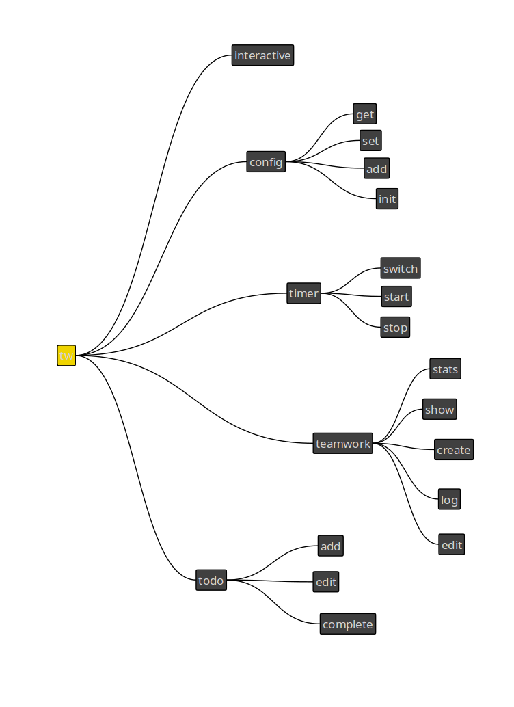

# Teamwork-Go

teamwork-go is a cli to interact with [Teamwork](https://www.teamwork.com/) time entries.

## Install

* Download the latest release from the [releases page](https://github.com/rtslabs/teamwork-go/releases) and unzip.
* Copy the `teamwork-go` binary to a location in your path `sudo cp teamwork-go /usr/local/bin/`
* Create a config file (this can be skipped if you prefer to use command line flags):

    ```bash
    cat <<EOF > ~/.teamworkgo.yaml
    global:
    companyName: [company_xxx]
    apiKey: [apikey_xxx]
    userId: [userId_xxx]
    EOF
    ```

## Run

If the binary is on your path simply run `teamwork-go` from a terminal
been
## Contribute

* Install Golang and set up GOROOT & GOPATH: https://golang.org/doc/install
* Clone repository and get project dependencies. `go get` will clone the repository to `$GOPATH/src/github.com/[username]`. This is important for linking local dependencies.

    ```bash
    go get -v github.com/rtslabs/teamwork-go/...
    ```

* Commands for local development (from project root):
    * Run: `go run main.go [command]`
    * To build a standalone binary: `go build`
    * To install dev version: `go install`

* Architecture

    To edit architecture diagrame open the [architecture](architecture.mapz) file in [Labyrinth](https://people.gnome.org/~dscorgie/labyrinth.html)
    


```
favorite {
    name,
    taskId,
    taskListid,
    projectId,
    date,
    message,
    hours,
    minutes,
    billable
}

todo {
    name,
    taskId,
    projectId,
    due-date,
    description
}


hours tw stats [summary]
    --date [date/year/month/week/day]
    --favorite

hours tw stats weights
    --used-since [date/year/month/week/day]
    --used-before [date]
    --used-on [date]

hours tw show entries
hours tw show tasks
hours tw show projects
hours tw show taskLists
    --used-since [date/year/month/week/day]
    --used-before [date]
    --used-on [date]
    --assigned
    --tags
    --favorite

hours tw create task
hours tw create taskLists
    --stuff

hours tw log <taskId/favorite>
    -- [ all of favorites ]
    --favorite
    --json opens editor
    --previous
    --git-logs

tw edit <entryId>
    ^^
hours show favorites
    --favorite

hours favorite <name>
    --^^

hours config [<key>[=<value>]]
    --dir
    (key, url, google key)
hours config init
    --dir

hours timer start <name>
    --arrived

hours timer stop <name>
hours timer switch <name>

hours timer time <name>
    --start
    --stop
    --duration
    --stop-all

hours todo add <name>
hours todo complete <name>
    --^^


global flags
    --json

The pattern to follow is APPNAME VERB NOUN --ADJECTIVE. or APPNAME COMMAND ARG --FLAG


src
    main.go
    cmd
        config
            ... .go
        timer
        ...
    configuration
        favorites
    teamwork
    googlecal
    status
    interactive
```